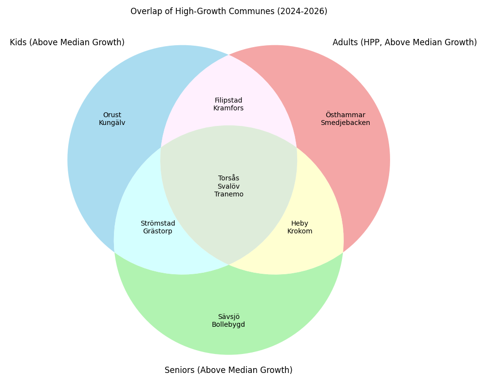

# Winning in the Swedish Market
## Delivering a Data-Driven Forecast for Expansion (2024–2026)

---

# 1. The Business problem

Sweden is a stable and substainsial market, but growth is uneven and highly local.
The biggest question for your market entry isn’t **“How big is the Swedish population?”**
It’s **“Where will our future customers actually be in the near future?”**

Getting this wrong means:
* Investing in the wrong cities
* Overbuilding where demand is shrinking
* Missing the fastest-growing future markets

---
# 2. Why Today’s Insight Isn’t Enough
To make confident decisions about location, product mix, and capital allocation, we need:

* A clear view of which markets are growing vs. shrinking

* And a way to compare them consistently at the national level

But today, demographic change in Sweden is highly local and not intuitive, even small communes shift in very different ways.

This is the gap my analysis addresses directly.

---
# 3. A National, Bottom-Up Forecast Purpose-Built for Market Entry

This analysis builds a national, bottom-up demographic forecast for how the population might look 2026 and translated it into actionable investment tools.

My analysis answers three strategic questions:
1. Where are our future customers concentrated?
2. How will these markets change in the next two years?
3. Which communes deserve flagship investment vs. cautious testing?

---
# 4. Why a 2-year forecast

I chose a 2-year forecasting window because it matches real-world commercial timelines:
* Site selection & lease negotiation
* Construction and refurbishment
* Staffing and supply chain contracts
* Market-entry marketing campaigns

A two-year forecast provides **maximum** relevance for decisions being made today.

---
# 5. Segmentation Ensures Decisions Align With Real Consumer Needs

Understanding *who* is driving population change is just as important as knowing *where* it occurs.  Different demographic groups generate **fundamentally different service, product, and investment needs**, which means:

* Location strategy changes by segment
* Format size and staffing requirements shift
* Product mix and service offering vary
* Long-term viability depends on demographic balance

---
To ensure our forecast directly informs commercial decisions, the analysis focuses on three strategic consumer groups:

**Kids (0–20)**

* Indicates family presence and demand for education-adjacent retail and local services.

**Adults 20–65 (Core Consumers, HPP)**

* Drives the bulk of retail and service spending, critical for revenue planning.

**Seniors (65+)**

* Signals need for healthcare, home services, and adapted retail formats.

These segments ensure the analysis ties directly to format, staffing, and product mix decisions.

---

# 6. How the Forecast Works

**Goal:** Predict where the population segments will grow across Sweden’s communes by 2026.

**Approach:**  
* **Aggregate & Segment:** Combine 9 years of SCB population data (2015–2024) into three strategic groups: Kids, Adults, Seniors.  
* **Predict Change:** Use historical trends and regional context to forecast population growth per segment at the 1 km² grid level with *machine learning*.  
* **Communicate Insights:** Aggregate forecasts to the commune level and calculate expected percentage change to guide investment prioritization.  

**Outcome:** Provides a reliable, actionable view of growth and decline across Sweden’s communes, ready for strategic decision-making.

---

# 7. Why Simple Trends Fail

**Goal:** Ensures forecasts account for real-world complexity, not just historical averages.

**Why Simple Trendlines Fall Short:**  
* Assume yesterday’s growth rate repeats tomorrow.  
* Ignore structural shifts like urbanization or aging cohorts.  
* Miss the local context that differentiates one commune from another.

**Why Machine learning Works:**  
- **Learns Complex Patterns:** Captures multi-year momentum and non-linear shifts.  
- **Incorporates Local Context:** Combines grid-level data with regional/commune totals to account for geography and population density.  
- **Supports Confident Decisions:** Reduces risk of placing long-term investments in areas that appear stable today but are projected to decline.
---

# 8. The Quadrant Matrix as an actionable tool

I used the forecast to create a tool that guides investment based on two critical dimensions.

| Axis | Metric | Strategic Interpretation |
| :--- | :--- | :--- |
| **X-Axis (Market Size)** | Current Total Commune Population | How large is the market today? |
| **Y-Axis (Future Growth)** | Predicted **Percentage Increase** (2024–2026) | How much *new* market volume will I gain? |

---

# The Four Strategic Quadrants

| Quadrant | Name | Profile | Strategic Implications |
| :--- | :--- | :--- | :--- |
| **I.** | **Golden Markets** | Above Average Pop, High Growth | **FLAGSHIP INVESTMENT:** High immediate revenue, secure future. |
| **II.** | **Future Hubs** | Below Average Pop, High Growth | **EARLY ENTRY/SMALL FORMAT:** High-potential, emerging markets. |
| **III.** | **Mature / Decline** | Above Average Pop, Decline | **OPTIMIZE & DEFEND:** Focus on cost efficiency and defending existing service base. |
| **IV.** | **Shrinking** | Below Average Pop, Decline | **NON-STRATEGIC:** Minimal resource allocation. |

---

# Example Quadrant (HPP Adults)

---

# 9. What This Means for Our Core Consumer Strategy

This chart guides the recomemended investment strategy for our core retail and service offerings.

#### Actionable Insights:
* **Golden Markets (Example):** **Mölndal** and **Borås** are in the top right. They combine high current population with strong projected growth. **Action:** Justify immediate, maximum capital allocation for flagship stores or major service centers here.
* **Future Hubs (Example):** **Ljungby** is a key target. It shows lower current density but the high predicted growth. **Action:** Ideal for **early entry** with smaller service formats to secure a strong future foothold.
* **Declining Markets (Example):** **Umeå** is in the bottom right. **Action:** Avoid any new long-term commitments here.

---

# 10. Resource Allocation Overlap

Where should I invest for maximum market impact across **all three** segments?

I analyzed the market overlap, filtering the data to only include communes predicted to show **positive absolute growth** in at least one demographic.

| Segment Type | Strategic Rationale |
| :--- | :--- |
| **ALL THREE (Total Market Hotspots)** | **MAXIMUM ALLOCATION:** These communes (e.g., **Orsa** and **Vellinge**) are seeing diverse, simultaneous growth across all ages. Which might justify a centralized distribution hub or diversified multi-service center. |
| **Kids & Adults (Family Hotspot)** | **DIVERSIFIED FOCUS:** These regions are ideal for products/services focused on the working family life cycle. (e.g., **Båstad** shows high growth in both Kids and Adults, signaling strong demand for family-friendly retail locations). |
| **Seniors Only (Specialized)** | **NICHE INVESTMENT:** Allocate funds strictly toward specialized services (health, home assistance) tailored to the elderly in these regions (e.g., **Älmhult**). |

---
# Market overlap example

---

# 11. Final Recommendation, Where to Act

The analysis provides the data foundation needed to commit capital with confidence.

### My Strategic Priorities for the Board:

1.  **LOCATION:** Prioritize site selection in the top-ranked **Golden Markets** and **Future Hubs** from the Quadrant Matrices.
2.  **RESOURCE ALLOCATION:** Immediately prioritize total market hotspots for major capital expenditure due to their secure, diverse future growth.
3.  **PRODUCT MIX:** Ensure regional inventory and service plans strictly align with the dominant growth segment identified in the overlap analysis to avoid wasted investment.
---
# 12. Next Steps

Before committing capital, it is critical to ensure that forecasts are reliable, actionable, and free from artifacts. It is important to recognize that this is just a tool for improved decision making.

**Key Actions:**

* **Validate Data Sources:** Ensure completeness, accuracy, and consistency across all input datasets.  
* **Stress-Test Predictions:** Evaluate how forecasts respond to changes in key assumptions or outliers.  
* **Review Anomalies Manually:** Identify any communes with unusual patterns or unexpected growth/decline.  
* **Align Assumptions with Stakeholders:** Confirm that modelling choices reflect business realities and internal expertise.

**Outcome:** Build confidence that strategic decisions are grounded in robust, trustworthy data and modelling.

---

# I am ready for your questions.